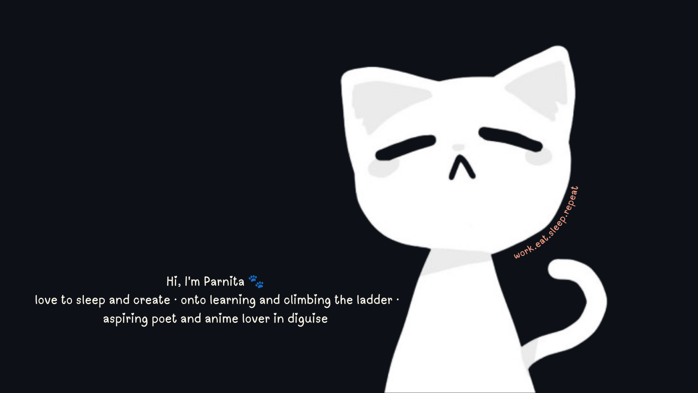

## 🐈‍⬛ ABOUT ME 
- sophomore @IGDTUW, ECE-AI
- Learning and climbing the ladder like a Shinobi🥷
- writing not just as a hobby but an Escape
- French and Japanese as 3rd and 4th language 

## 🧠 AREAS OF INTEREST

- Artificial Intelligence & Machine Learning
- Web 3 and Blockchain
- Generative AI Applications
- Large Language Models
- Research & Technical Reading
- Computational Social Science
- Open Source Software

### 🛠️ Tech Stack

**Languages**

**Hosting / SaaS**

**Frameworks, Platforms & Libraries**

**Databases**

**Design**

**ML/DL**

**Tools**

**Currently Exploring**
- Machine Learning
- Generative AI Applications
- Web 3
- LLM Applications
- AI-powered Full-Stack Development

## 🌱 BEYOND CODE
-  SheFi Scholar
-  GSSoc'26 Top 400 Contributor
-  love going down research rabbit holes
-  A Learner
-  A explorer
and a writier

## 🛠️ PROJECTS

| Project | Description | Tech Stack | Link |
|---|---|---|---|
| **Mochi** | AI-powered budget tracker built for the AWS Student Builder Cohort — ranked Top 15/216 | Next.js 15, Tailwind CSS, NextAuth.js, AWS DynamoDB, AWS Amplify, AWS Bedrock | https://github.com/parnita-Singh/MOCHI |
| **100 Days of Solana** | 100-day challenge learning Solana development, started via an MLH challenge | Solana, Rust *(update if different)* | https://github.com/parnita-Singh/100-days-of-solana |
| [Stock Market Predictor] | ML-based stock prediction model trained on Google historical data with 75% accuracy | Python, Pandas, Scikit-learn, Matplotlib |
| [AI Virtual Keyboard]| Real-time gesture-based virtual keyboard using hand landmark detection via webcam | Python, OpenCV, MediaPipe |

## SOCIALS 

## STATS

  <i>thanks for visiting — The cat welcomes 🐾 </i>

